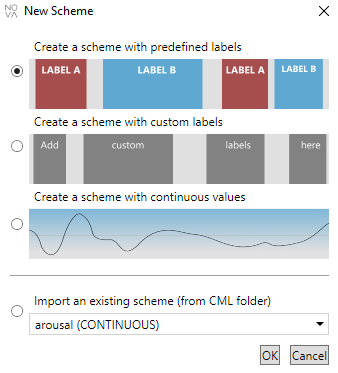
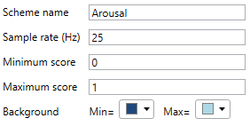
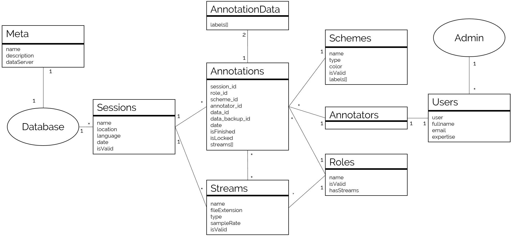
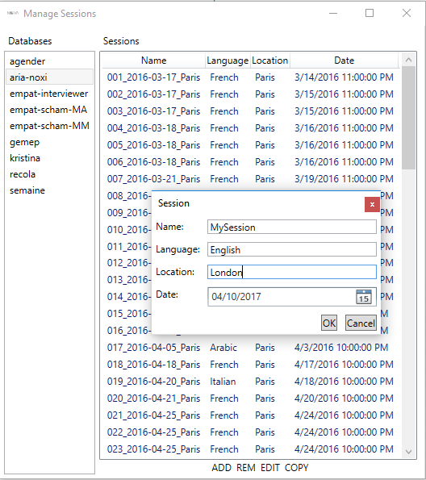
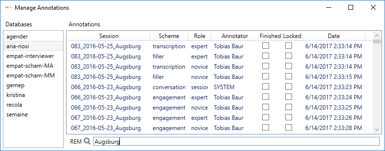
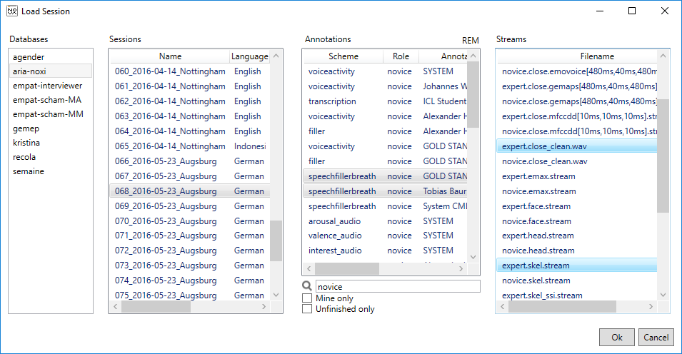
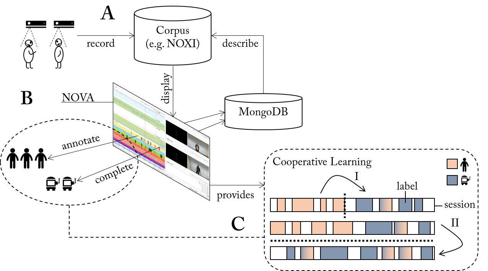
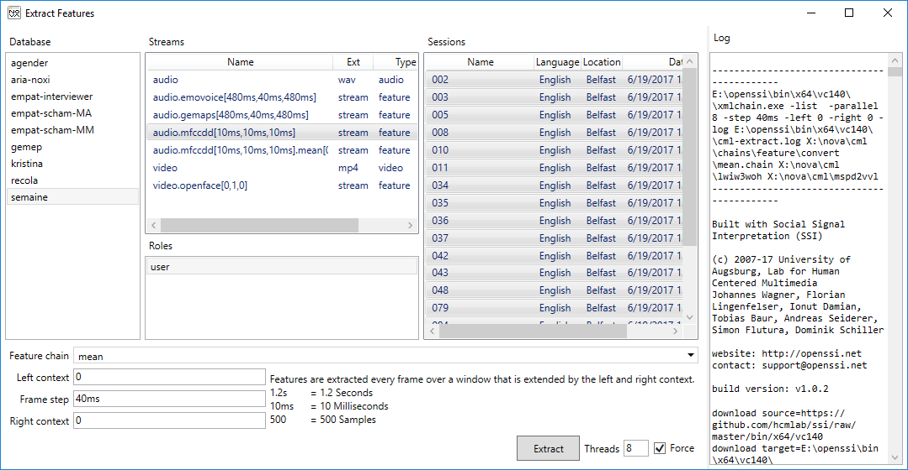
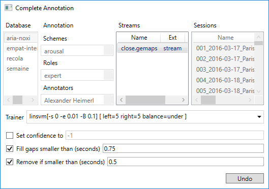
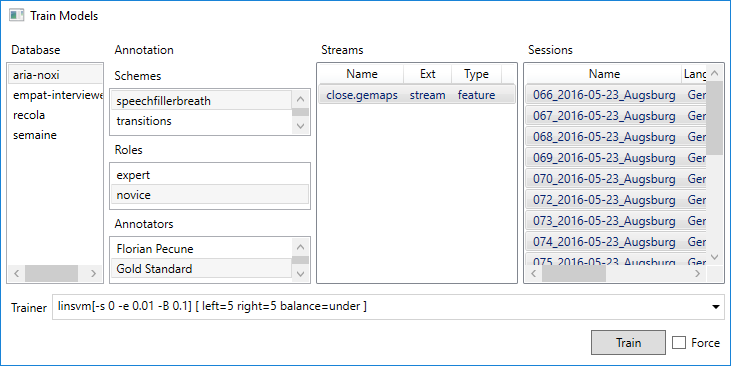

% NOVA Documentation
% 
% 03/07/2017

# Introduction {#introduction}

The **N(On) Verbal Annotator ** (NOVA) offers a graphical interface for machine-aided annotation of large multi-modal databases. It is developed as a side project of the Social Signal Interpretation (SSI) framework to describe databases recorded with SSI. It's key features are:

* **Visualization and playback** of multi-modal data including support for skeleton and face tracking
* Annotation based on **various schemes** (e.g. discrete and continuous)
* **Database back-end** to share annotations between multiple annotators
* Integrated tools to apply machine-aided **cooperative learning**

# Installation

The latest version of NOVA can be accessed at:

<https://github.com/hcmlab/nova>

Just download or check-out the release branch and start 'nova.exe' (yes, NOVA is available for Windows systems only).

If you do not see videos on playback, please make also sure you have the right codecs installed. A good choice is the K-lite Codec Pack (You can leave all settings on default, but make sure to not not install any 3rd party software that comes with the installer).

# Manual Annotation

In the following we will explain the basic steps to manually create and edit an annotation. 

## Main Interface

The following image shows NOVA's main interface. On the top, media files are displayed in horizontally aligned boxes. Videos and tracking data (e.g. facial points) are handled as media and displayed frame by frame. Below that other stream data (e.g. audio waveforms) are displayed as time series in vertically aligned tracks. In the same way, annotation data is visualized in vertical tiers. Below the annotation tiers a slider bar allows it to move the displayed clip along the time scale. The clip can be enlarged or shrink by changing the size of the scroll button. Double-clicking the scroll button will zoom out to show the whole session at once (note: if navigation becomes slow try zooming in). Playback buttons are found on the bottom of the window. A red cursor marks the current playback position (it will be moved during playback and when the signal track is clicked). A green cursor shows the current position on the annotation tier and helps to align labels with the signal tracks. A list of annotations items of the currently selected annotation tier is shown on the left. When an item is selected by the red cursor is moved to the according segment in the tier. Only one media, stream and annotation can be selected at a time. When an entity is clicked which is not already selected, it receives the focus (ie.g. its border turns dark gray) and additional information is displayed in the status bar.

{#fig:manual-interface width=100%}

## Loading Files

To add a file the FILE menu can be used. It allows to select multiple media, stream or annotation files at once. Alternatively, files or folders can be dropped from the explorer. NOVA supports all common video formats, audio wave files and SSI stream files, as well as, CSV files, which will be imported as stream files (in the latter case the user has to provide number format and sample rate). The currently selected media, stream or annotation file can be removed by clicking the 'x' in the according status bar. Clicking the 'Clear' button on the right bottom will remove all files at once. The current workspace can be stored to a project file and reloaded at a later point from the FILE menu (or via drag and drop). Note that in the following we will generally refer to any file that is not annotation as stream.

## Creating an Annotation

After loading at least one media or data stream, new annotations tracks can be added to the project. New annotations are created by clicking the 'File' button (bottom left). Alternatively, annotations can be created from the database, too, see [here](#database-create-annotation). A window pops up, which allows to select a scheme type:

{#fig:manual-new-scheme width=40%}

* Discrete:

	Discrete annotations consist of a list of labelled time segments. Each segment has a start and and end time (in seconds) and a name (label). Segments can be of varying length, may overlap and possibly there are gaps between adjacent segments. An annotator cannot change the names of labels and has to assign exactly one label to each segment. If none of the labels is applicable the label "GARBAGE" is always available.

	{#fig:manual-types-of-annotation-discrete width=100%}

	Scheme name, class names and colours are set in the following dialogue:

	{#fig:manual-new-scheme-discrete}

* Free:

	Like discrete annotations, but this time annotators are free to choose the label names. This is obviously useful if an annotation task can not easily be reduced to a few labels (for example in case of speech transcriptions). Of course there is the risk that the same phenomenon may be labelled differently (either because a synonym is used or due to misspelling).

	{#fig:manual-types-of-annotation-free width=100%}

* Continuous:

	In contrast to discrete annotations, continuous annotations assign numerical values (label score) instead of label names. Also, they have a fixed sample rate, i.e. label scores are assigned in regular intervals. For instance, a sample of 2 Hz means that an annotator has to assign two scores each second. All score values have to be within a fixed interval (defined by a minimum and a maximum score). Optionally, it is possible to quantize the interval into limited steps. The value NAN is assigned when no score is applicable.

	{#fig:manual-types-of-annotation-continuous width=100%}

	Scheme name, sample rate, value range and colours are set in the following dialogue:

	{#fig:manual-new-scheme-continuous}


## Editing an Annotation

* Free:

	To place a new segment right click on the start position of the label, keep button pressed and move the cursor to the end position (or vice-versa). Now release the button and a new segment will be added (and selected). If 'Force Label' is active you will be asked to enter label name and confidence. Otherwise it gets the label that was previously used. To edit an existing segment left click inside the segment (the colour of the selected segment will change to blue). If you now move the cursor near the borders two arrows will be displayed and you can change the position by holding down the left mouse button. If you move the cursor towards the centre of the segment you can move the whole segment along the track. To change the label hit the 'W' key. Note that you can change the position of a label during playback. If 'Follow Annotation' is active a newly added segment will be immediately played back. Alternatively, you can also jump to a segment by selecting it from the list left to the annotation tiers. It is also possible to select several segments in the list and rename them all at once.

* Discrete:

	Works in the same way as free annotations, but when entering or changing a label a selection dialogue pops up that allows you to select a name from the loaded scheme. Alternatively, you can change the label name of a selected segment by pressing a key between '0' and '9'. For example, if the selected scheme contains three names 'A','B' and 'C' pressing '1' assigns 'A', '2' assigns 'B', and '3' assigns 'C'. Any other numbers and '0' assign the garbage class.

* Continuous:

	To change the values in a continuous track hold down the right mouse button and move the cursor to the desired position within the track. You will notice that the values immediately start to follow the cursor. Hitting 'L' (or switching on the live button in the status bar) turns on the live mode, which no longer requires to hold down the right mouse button. Instead a white button is displayed at the left border of the current track to mark the current value. The height of the white button can either be controlled by the vertical position of the mouse cursor (press key 'M' or activate check box next to live button). Or otherwise by pressing a key between '0' and '9' (see option 'number of levels in live mode' in the SETTINGS). This is especially handy to annotate during playback. Hitting 'L' again turns off the live annotation mode and brings back the default behaviour.

Pressing 'Ctrl+Z' and 'Ctrl+Y' allows it to undo and redo the previous changes. To save an annotation go to the ANNOTATION menu or press 'Ctrl+S'.

## Shortcut Cheat Sheet

**Universal**

 Shorcut					Description    
 -------					------ 
 arrow key left				Rewind in small steps
 arrow key right 			Fast forward in small steps
 space						Start / Stop autoplay
 T + arrow key up			Select the annotation tier above the current one
 T + arrow key down			Select the annotation tier beneath the current one
 strg + L					Complete the current session automatically
 strg + arrow key left		Setting the media position to the beginning of the currently selected label
 strg + arrow key right 	Setting the media position to the end of the currently selected label
 alt +  arrow key down  	Copying label to the tier below
 alt + arrow key up 		Copying label to the tier above
 shift + dragging timeline  Zoom in / out to the current media position

**Free / Discrete Scheme**

 Shorcut					Description    
 -------					------ 
 0 - 9						Setting the label for the selected segment
 S							Splitting the selected segment in two parts on the green annotation cursor
 W							Creating a new label between the green annotation cursor and the red media position cursor
 strg + C      				Copy the currently selected segment
 strg + K					Delete all annotations the are on the right side of the green annotation cursor 
 strg + V					Paste a copied segment
 strg + X					Cut the selected segment
 strg + Y					Redo
 strg + Z					Undo
 shift + dragging			Creating a label from start to end position (same as dragg with right mouse)

**Continuous Scheme**

 Shorcut					Description    
 -------					------ 
 0 - 9						Setting the level of the selected segment

## File Format

An annotation can be saved to a file on disk. Actually, it is stored in two separate files: a header file (.annotation) and a data file (.annotation~) with the same file name. The header contains information about the scheme, while the data file holds the actual annotation data, either in ASCII (default) or in binary format.

* Discrete: 

	.annotation

	A discrete scheme consists of a list of predefined labels represented by a name and an unique identifier (id). Optionally, colour values can be assigned to the background and each label.

	~~~~ xml
	<?xml version="1.0" ?>
	<annotation ssi-v="3">
		<info ftype="ASCII" size="71" />
		<meta annotator="Annotator"/>
		<scheme name="laughter" type="DISCRETE" color="#FFEEECE1">
			<item name="laugh" id="0" color="#FFC0504D" />
			<item name="speech" id="1" color="#FF1F497D" />
		</scheme>
	</annotation>
	~~~~

	.annotation~

	The data file contains of one segment per line, which are structured as follows:
	
	\<beginning of a segment in seconds\> ; \<end of a segment in seconds\> ; \<label id as specified in the header\> ; \<confidence value\>

	~~~~
	2.96;3.92;1;1    // first segment
	8;9.72;1;1       // second segment
	18.8;20.08;1;1   // ...
	23.91;24.87;1;0.6
	27.22;28.61;1;0.9
	29.2;30.41;0;1
	...
	~~~~

* Free:

	.annotation

	A free scheme looks similar, but does not define labels: 

	~~~~ xml
	<?xml version="1.0" ?>
	<annotation ssi-v="3">
		<info ftype="ASCII" size="110" />
		<meta annotator="Annotator"/>
		<scheme name="transcription" type="FREE" color="#FFFFFFFF"/>
	</annotation>
	~~~~

	.annotation~

	In contrast to a discrete scheme, in a free annotation the id field is replaced by a string. The last entry may hold an optional colour label.

	~~~~ 
	2;2.56;hi;1
	2.72;3.16;<LAUGH>;1;color=#FFFF0000
	4.56;5.28;yes;1
	10.24;11.64;no not at all no no;1
	12.04;13.4;so what it is exactly;1
	17.56;18.16;okay;1
	27.16;27.64;yes;1
	...
	~~~~

* Continuous:

	.annotation

	A continuous scheme contains a samplerate (sr) in hz, as well as, the minimum (min) and maximum (max) score. Optionally, min and max can be assigned colours.

	~~~~ xml
	<?xml version="1.0" ?>
	<annotation ssi-v="3">
		<info ftype="ASCII" size="7501" />
		<meta annotator="Annotator"/>
		<scheme name="arousal" type="CONTINUOUS" sr="25" min="-1" max="1" mincolor="#FFFFFFFF" maxcolor="#FF4F81BD" />
	</annotation>
	~~~~

	.annotation~

	In the according data file each line represents one frame represented by two values:
	
	\<score\> ; \<confidence value\>
	
	The time stamp (in seconds) of a frame can be referred by dividing the line index by the sample rate given in the header.

	~~~~
	-0.021;1   // 0 / 25 hz = 0 s
	-0.017;1   // 1 / 25 hz = 0.04 s
	-0.016;0.6 // 2 / 25 hz = 0.08 s
	 0.011;0.4
	 0;1
    ...
	~~~~

# Database

To support a collaborative annotation process, NOVA maintains a database back-end, which allows users to load and save annotations from and to a MongoDB running on a central server. This gives involved annotators the possibility to immediately commit changes and follow the annotation progress of the others.


## Setup MongoDB

We will describe two strategies: a) set up MongoDB with Docker *or* b) set up MongoDB natively. In the following, make sure to replace the default password "PASSWORD".

First, we install Docker (<https://www.docker.com/>) and run:

~~~~
docker pull mongo:latest  
docker run --restart always -p 27017:27017 -h mongodb.local --name nova -d -t mongo:latest --auth
~~~~

*or*

We install MongoDB (<https://www.mongodb.com/download-center#community>) and run:

~~~~
mongod --auth
~~~~

MongoDB now runs on 127.0.0.1:27017 and we can connect to it:

~~~~
docker exec -it nova mongo admin
~~~~

*or*

~~~~
mongo admin
~~~~

We add an administrator:

~~~~
use admin
db.createUser({ user: 'admin', pwd: 'PASSWORD', roles: [ { role: "root", db: "admin" } ],  customData: {fullname: "ADMIN", email: ' ', expertise: NumberInt(0)}}); 
exit
~~~~
   
And reconnect afterwards:

~~~~
docker exec -it nova mongo -u admin -p PASSWORD --authenticationDatabase admin 
~~~~

*or*

~~~~
mongo -u admin -p PASSWORD --authenticationDatabase admin 
~~~~

We add a custom role to allow users to change their passwords and update their profile:

~~~~	
use admin
db.createRole(
   { role: "changeOwnPasswordCustomDataRole",
	 privileges: [
		{
		  resource: { db: "", collection: ""},
		  actions: [ "changeOwnPassword", "changeOwnCustomData", "viewUser" ]
		}
	 ],
	 roles: []
   }
)
~~~~	
	
Finally, we add two default users:
	
~~~~		
db.createUser({ user: 'gold', pwd: 'PASSWORD1', roles: [ { role: "readWriteAnyDatabase", db: "admin" }, {"role" : "changeOwnPasswordCustomDataRole", "db" : "admin"}], customData: {fullname: 'GOLD STANDARD', email: ' ', expertise: NumberInt(0)}}); 

db.createUser({ user: 'system', pwd: 'PASSWORD2', roles: [ { role: "readWriteAnyDatabase", db: "admin" }, {"role" : "changeOwnPasswordCustomDataRole", "db" : "admin"} ], customData: {fullname: 'SYSTEM', email: ' ', expertise: NumberInt(0)} });
~~~~			

We can now test the server:		

~~~~			
show dbs
~~~~			

To connect to the MongoDB server in NOVA, we open the settings by clicking the wheel in the menu and switch to the 'Database' tab. Here we enter the host and port number of the MongoDB server and the user credentials. The dialog also allows it to customize the download and CML directory. After applying the changes, NOVA tries to connect to MongoDB. If a connection is established it will be displayed in the status bar.

{#fig:database-connect}

## General Structure

A database in NOVA aggregates data recorded within the same experiment. It is basically a collection of recorded stream files (data) and descriptions marking interesting events in the data (annotations). NOVA can handle multiple databases and offers tools to maintain them and incrementally accumulate new data and annotations. Generally, stream files are stored on disk and annotations are stored in a MongoDB. Each database consists of one or more sessions. A session is a single and continuous recording distributed over one or more stream files. Each stream file is assigned to one or more subjects, which are represented as roles (e.g. speaker vs listener). A stream file also has a unique name indicating the source of the recording (e.g. audio or video) and a file extension (e.g. wav or mp4). On disk, a database has the following structure:

~~~~
<database-1>/
	<session-1>/
		<role-1>.<stream-name-1>.<stream-ext-1>
		<role-2>.<stream-name-1>.<stream-ext-1>
		<role-1>.<stream-name-2>.<stream-ext-2>
		<role-2>.<stream-name-2>.<stream-ext-2>
		...
	<session-2>/
		<role-1>.<stream-name-1>.<stream-ext-1>
		<role-2>.<stream-name-1>.<stream-ext-1>
		<role-1>.<stream-name-2>.<stream-ext-2>
		<role-2>.<stream-name-2>.<stream-ext-2>
		...
~~~~

In the MongoDB this is reflected by different tables storing the sessions, the roles, and the streams. In addition, also annotators, annotation schemes and annotations are stored. It is important to note that each annotator can own exactly one annotation per scheme and role. This means it is not possible to store different versions of an annotation in the database.

{#fig:database-structure-general}

{#fig:database-structure-detail}

* Meta: Meta information about a database, including the data server location, and
a description
* Sessions: Stores general information for each recording session, such as location,
language and date.
* Annotators: Gives specific users access to the database.
or machine!).
* Users: Stores the credentials of all users.
* Roles: Stores the different roles subjects can take on during a recording session
(e. g., listener vs speaker).
* Streams: Stores the recorded stream files. Each file is assigned to a media type, a
session, a subject and a role. An url is included that points to the location where the
file can be downloaded.
* Schemes: Stores the available annotation schemes.
* Annotations: Stores the headers of created annotations. An annotation is linked
to an annotator, an annotation scheme, a role and a session. Optionally, a list of
stream files is referenced to store which information should be displayed during the
annotation process.
* AnnotationData: Contains the actual annotation data (segments or scores) for an
annotation. Additionally a Backup is stored for each annotation, allowing the user
to go back to the previous version.

## File Server

Although stream files have to be locally available when displayed in NOVA, it is possible to store the data on a server and let NOVA download them on demand. This is especially useful for large database, where annotators only work on small subsets. 

TODO: add more details how data can be stored to and accessed from a server

## Administration

The 'Administration' sub-menu of the DATABASE menu offers tools to create and maintain databases. Note that most of the functions are only visible to users with administrative rights. 

* 'Manage Users': add or edit an user account. Users that have been added to the list can connect to the MongoDB and contribute to one or more databases. 

{#fig:database-manage-users}

* 'Manager Databases': add or edit a database. After a database has been created, users can be added which allows them to create and edit annotations. Depending on their role, they can view ('read') annotations and create own annotations ('readWrite'). Users with administrative rights ('dbAdmin') can also edit the annotations of other users. 

{#fig:database-manage-databases}

* 'Manage Sessions': add or edit a session. After a recording is finished, it has to be added to the database first. The name of the session has to match the folder name, where the stream files are stored. Only, stream files that fit the roles and streams in the database will be accessible.

{#fig:database-manage-sessions}

* 'Manage Annotations': lists the annotations of a database. For each annotation the session, scheme, role and annotator are given. A search window on the bottom helps to filter relevant annotations. The dialog only allows to delete annotations. Annotations are either manually created by users or when annotations are merged together. However, they can also be automatically predicted using machine learning tools (see next chapter).

{#fig:database-manage-annotations}

## Loading a Session

The DATABASE menu allows to load annotation and files for a session (note that this will clear the workspace). In the following window you can select multiple annotations and streams belonging to a certain session of a database. Turn on 'Mine only' to filter only your own annotations and 'Unfinished only' to hide annotations that have already been marked finished. Stream files that are not locally available yet, are displayed in red. If selected NOVA will try to download them before the session is displayed.

{#fig:database-load-session}

## Creating an Annotation {#database-create-annotation}

After loading at least one stream file it is possible to add new annotations to the database by pressing the 'Database' button on the bottom left. You will now be prompted to select a scheme and a role. If an according annotation already exists it will be loaded, otherwise an empty one is created. When the annotation is saved it is automatically written to the database. In case you want to store it on disk use 'Export Selected As' from the ANNOTATION menu. You can also load an existing annotation from another user. As soon as you save the annotation for the first time it will be stored under your name.

# Cooperative Learning

NOVA features tools to considerable speed up the annotation process. The following image illustrates the overall system. (A) Database with recordings of human interaction. (B) NOVA's interface allows to distribute and accomplish annotation tasks among human annotators. (C) At times, Cooperative Learning (CL) can be applied to automatically complete unfinished fractions of the database. Two strategies are available (bottom right box): (I) A session-dependent model is trained on a partly annotated session and applied to complete it. (II) A pool of annotated sessions is used to train a session-independent model and predict labels for the remaining sessions. In both cases, confidence values guide the revision of predicted segments (here marked with a colour gradient).

{#fig:cl-overview}

Note that all tasks related to machine learning (ML) are outsourced to Social Signal Interpretation (SSI) framework and executed in a background process. To learn more about SSI please visit the project site:

<http://openssi.net>

## Feature Extraction {#cl-feature-extraction}

Features can be automatically extracted from the stream files of a database. The type of feature extraction is defined in a SSI chain file. When run through a chain an input stream first passes a number of filter steps, which are applied in-series, i.e. the output of the first filter servers as input for the second filter and so on. Afterwards, the output of the last filter operation is forwarded to each feature component and results are concatenated. For instance, to extract from an audio input the famous Mel-Frequency Cepstral Components (MFCC) we can define the following chain:

``` xml
<chain>
	<meta frameStep="10ms" leftContext="10ms" rightContext="10ms"/>
	<register>
		<item name="signal"/>
		<item name="opensmile"/>
	</register>
	<filter>
		<item create="OSPreemphasis"/>
	</filter>
	<feature>
		<item create="OSMfccChain" option="mfcc"/>
	</feature>
</chain>
```

Here, the audio stream is first run through a pre-emphasis filter and afterwards MFCC features are extracted over a sliding window of 25 ms with a frame step of 10 ms (timings can be overwritten in NOVA). To configure the MFCC extraction (e. g., the number of coefficients) a separate option file is created (here ’mfcc’). Note that the chain has two dependencies ``ssisignal.dll`` and ``ssiopensmile``, which will be automatically downloaded. To learn more about chains, please visit the SSI documentation:

<https://rawgit.com/hcmlab/ssi/master/docs/index.html#xml-basics-transformer-chain>

To use a chain file in NOVA it must be copied to the CML folder ``cml\chains\<type>\<group>``. To start a feature extraction process, we select 'Extract Features' from the 'LEARNING' menu. A dialogue pops up, where we can select the stream for which features will be extracted. All chains matching with the type of the feature (i.e. the <type> sub folder in which the chain is stored equals the type of the stream), are now displayed and can be selected. If wished, left context, frame step, and right context can be set. Finally, we can select the sessions and start the feature extraction. Here, the number of threads defines how many files will be processed in parallel. The file name of the new stream is ``<old-name>.<chain-name>[left,step,right]`` and is automatically added to the database. Unless 'Force' is selected, stream files that already exist will not be overriden and feature extraction is skipped for these sessions. 

{#fig:cl-feature-dialog}

## Trainer Templates {#cl-trainer-templates}

TODO: explain how to create trainer templates

## Annotation Completion

NOVA allows it to complete a partly finished annotation. Note that NOVA expects that everything before the last annotation item on the tier has been manually annotated. The following image shows a partly finished annotation before completion is applied: 

{#fig:cl-completion-before}

Now, call 'Complete Current Annotation' from the LEARNING menu. In the dialogue that pops up you can now select the [feature stream](#cl-feature-extraction) to which machine learning should be applied. Only streams are displayed for which at least one [trainer template](#cl-trainer-templates) is available. Depending on the scheme, there may be additional options that allow you to tune the generation of the prediction. E.g. in case of a discrete scheme you can automatically fill small gaps or remove segments below a threshold.

{#fig:cl-completion-dialog}

If you are not happy with the completion you are still given the opportunity 'Undo' the changes now. Otherwise, you can now continue to work with the automatically completed annotation.

{#fig:cl-completion-after}

Note that predictions with a low confidence will be marked with a special pattern to guide manual revision. You can change the threshold in the SETTINGS ('Correction certainty level'). Once a label is revised the confidence is automatically set to 1 and it is not longer marked.

{#fig:cl-completion-revise}

## Model Training {#cl-model-training}

Once annotations for a number of sessions have been accomplished a 'strong' classification model can be trained. This requires that [features](#cl-feature-extraction) have been extracted for the sessions and a compatible [trainer template](#cl-trainer-templates) is available. Now choose 'Train Model' from LEARNING and a dialogue pops up. Here you can select a scheme, one or more roles and an annotator. Sessions for which an annotation exists that satisfies the selection are now shown and can be selected. Finally, choose the stream for which a machine learning model should be trained. Note that only those streams are listed for which at least one [trainer template](#cl-trainer-templates) is found. By pressing 'Train' model training is started. Switch on 'Force' if you want to override an existing model.

{#fig:cl-training-dialog}

## Annotation Prediction

With a trained model it is now possible to predict annotations for one or more sessions. Therefore choose 'Prediction Annotations' from the LEARNING menu. Once you have selected a scheme, a role and an Annotator those sessions will be listed, which do not have a matching annotation yet. You can turn of the filter by selecting 'Show existing', however, make sure you are not occidentally overriding existing annotations (no undo available!). Finally, select the stream for which a machine learning [model](#cl-model-training) has been trained (only streams are listed for which at least one model is found). Depending on the scheme, there may be additional options that allow you to tune the generation of the prediction. E.g. in case of a discrete scheme you can automatically fill small gaps or remove segments below a threshold. After pressing 'Predict' annotations will be created based on the chosen model for all sessions that have been selected and stored under your name (if you are an administrator you may also generate annotations for another user).

{#fig:cl-prediction-dialog}